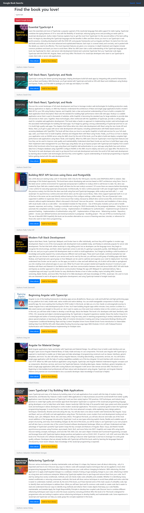
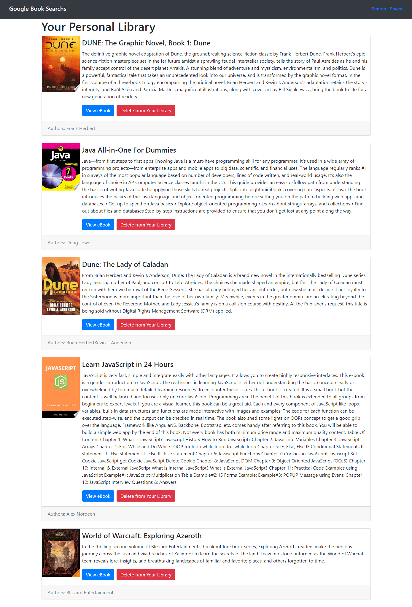

# **Google Books Search**

[](#) [](#) [](#) [](#) [](#)

### :rocket: **Deployed on Heroku**

https://dragontalker-library.herokuapp.com/

---

### **Table of Contents**

- [Description](#Description)
- [How to Use](#how-to-use)
- [How to Contribute](#how-to-contribute)
- [Developer Log](#developer-log)
- [License](#License)
- [Author Info](#auothor-info)

# :mag_right: Description

`MERN` stands for MongDB, Express.js, React.js and Node.js. This MERN application allows user to search books from Google Books api and saved to MongoDB through Express servers. Furthermore, this is a SPA (single page application) where routing between different page is handled by React Router.

## :wrench: **Technologies Used**

- React
- React Hooks
- React Routers
- Express.js
- Node.js
- RESTful Api
- MongoDB
- Bootstrap 5
- HTML 5
- CSS 3
- JavaScript
- VS Code
- Heroku

[Back to the Top](#google-books-search)

# :crystal_ball: How to use

This application includes two features: search and save.

#### :mag: Search Feature

After launching the application, the user will be place in the search page. This search function allows user to find results from Google Books API. The screenshot below shows the search result for keyword `typescript`. Each returned results are presented in a card, which contains two functions: view eBook on Google Books, or saved this book to user's personal library.



---

### :floppy_disk: Saved Page



---

---

### :cd: **Installation**

For local installtion, both front-end and back-end need to be installed:

```bash
# Install back-end
npm install

# Install front-end
cd client
npm install
```

[Back to the Top](#google-books-search)

---

### :computer: **Usage**

After installtion completed, use the following commands for development:

```bash
# Initiate front-end only
npm run client

# Initiate back-end only
npm run watch

# Initiate full-stack using concurrent mode
npm run dev
```

[Back to the Top](#google-books-search)

---

### :space_invader: **Contact**

If you have any questions, email me at richard.yang.tong@gmail.com.

[Back to the Top](#google-books-search)

---

### :mortar_board: **License**

MIT License

Copyright (c) [2021] [Richard Yang]

Permission is hereby granted, free of charge, to any person obtaining a copy of this software and associated documentation files (the "Software"), to deal in the Software without restriction, including without limitation the rights to use, copy, modify, merge, publish, distribute, sublicense, and/or sell copies of the Software, and to permit persons to whom the Software is furnished to do so, subject to the following conditions:

The above copyright notice and this permission notice shall be included in all copies or substantial portions of the Software.

THE SOFTWARE IS PROVIDED "AS IS", WITHOUT WARRANTY OF ANY KIND, EXPRESS OR IMPLIED, INCLUDING BUT NOT LIMITED TO THE WARRANTIES OF MERCHANTABILITY, FITNESS FOR A PARTICULAR PURPOSE AND NONINFRINGEMENT. IN NO EVENT SHALL THE AUTHORS OR COPYRIGHT HOLDERS BE LIABLE FOR ANY CLAIM, DAMAGES OR OTHER LIABILITY, WHETHER IN AN ACTION OF CONTRACT, TORT OR OTHERWISE, ARISING FROM, OUT OF OR IN CONNECTION WITH THE SOFTWARE OR THE USE OR OTHER DEALINGS IN THE SOFTWARE.

[Back to the Top](#google-books-search)
